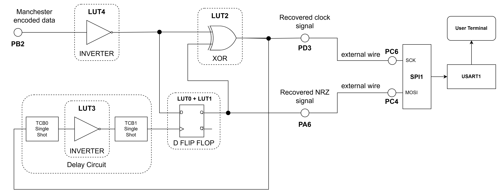

 # Manchester Decoder

The Manchester code is a line code in which the encoding of each data bit is either a transition from LOW to HIGH or a transition from HIGH to LOW. It is a self-clocking signal with no DC component.

There are two versions of the Manchester code. This project focuses on the Manchester coding as per IEEE 802.3. 
The Manchester code combines data and clock into a single signal, where one clock cycle is a Manchester-bit period. A transition always occurs in the middle of the bit period. Logic `0` is represented by a falling edge (HIGH to LOW transition) in the middle of the bit period, and logic `1` is represented by a rising edge (LOW to HIGH transition) in the middle of the bit period. 

In this application, the Manchester communication parameters are: baud rate 16000 bits/s, 8-bit transfer, MSb (Most Significant bit) is sent first, IEEE 802.3, Manchester version (negative edge is binary zero).

An example is presented in the figure below:

 

This project is an implementation of a Manchester Decoder using Core Independent Peripherals (CIPs) by following the interaction between TCB, Event System, CCL and SPI peripherals. The encoded data are received through a single data wire. The NRZ (Non-Return-to-Zero) signal and clock signal are recovered using the circuit composed of the CIP mentioned above. The resulting signals are routed to the SPI peripheral which reads the data. The decoded data are transmitted further via serial communication.

The Manchester encoded signal is received through a single wire. A decoding circuit is implemented using a combination of Configurable Custom Logic blocks and timers. The decoding circuit outputs the recovered NRZ data and a synchronized clock signal that are routed with jumper wires to the SPI1 peripheral configured in Client mode. The SPI1 peripheral will generate interrupts whenever a new byte is received, and the current byte will be stored in a buffer. The data are further transmitted via serial communication (USART1). A time-out mechanism is implement using TCB2 configured in periodic Time-out mode (an interrupt will be generated when no activity occurs on the Manchester data line for the duration of three bytes). A FIFO (First-In First-Out) buffer mechanism is implemented to facilitate the data storage and minimize data loss.

The block diagram of this application is presented in the figure below: 

 

## Related Documentation
More details and code examples on the AVR128DA48 can be found at the following links:
- [AVR128DA48 Product Page](https://www.microchip.com/wwwproducts/en/AVR128DA48)
- [AVR128DA48 Code Examples on GitHub](https://github.com/microchip-pic-avr-examples?q=avr128da48)
- [AVR128DA48 Project Examples in START](https://start.atmel.com/#examples/AVR128DA48CuriosityNano)

## Software Used
- MPLAB® X IDE 5.40 or newer [(microchip.com/mplab/mplab-x-ide)](http://www.microchip.com/mplab/mplab-x-ide)
- MPLAB® XC8 2.30 or a newer compiler [(microchip.com/mplab/compilers)](http://www.microchip.com/mplab/compilers)
- MPLAB® Code Configurator (MCC) 4.0.1 or newer [(microchip.com/mplab/mplab-code-configurator)](https://www.microchip.com/mplab/mplab-code-configurator)
- MPLAB® Code Configurator (MCC) Device Libraries 8-bit AVR MCUs 2.5.0 or newer [(microchip.com/mplab/mplab-code-configurator)](https://www.microchip.com/mplab/mplab-code-configurator)
- AVR-Dx_DFP 1.6.88 or newer Device Pack

## Hardware Used
- AVR128DA48 Curiosity Nano [(DM164151)](https://www.microchip.com/Developmenttools/ProductDetails/DM164151)
- Jumper wires

## Setup

The AVR128DA48 Curiosity Nano Development Board is used as test platform.

  
 
The following configurations must be made for this project:

System clock: 24 MHz

Global interrupts: Enabled

USART1:
  - 38400 baud rate
  - TX enabled
  - Async mode
  - 8N1 (character size: 8 bit, no parity, 1 stop bit)

TCB0:
  - Single Shot mode
  - Clock Source: CLKPER
  - Asynchronous mode: Enabled
  - Input Capture Event: Enabled

TCB1:
  - Single Shot mode
  - Clock Source: CLKPER
  - Asynchronous mode: Enabled
  - Input Capture Event: Enabled

TCB2:
  - Periodic Time-out mode
  - Clock Source: CLKPER/2
  - Input Capture Event: Enabled
  - Noise Cancellation Filter: Enabled
  - Capture/Time-out interrupt: Enabled

SPI1:
  - Client mode selected
  - SPI Mode 0
  - Alternate pins selected

LUT0:
  - IN0: EVENT A
  - IN1: Masked
  - IN2: Masked
  - TRUTH table: 0x02
  - Clock source: CLKPER
  - Sequential Logic: DFF

LUT1:
  - IN0: Masked
  - IN1: TCB1
  - IN2: Masked
  - TRUTH table: 0x04
  - Clock source: CLKPER
  - Sequential Logic: DFF

LUT2:
  - IN0: EVENT A
  - IN1: EVENT B
  - IN2: Masked
  - TRUTH table: 0x06
  - Clock source: CLKPER

LUT3:
  - IN0: TCB0
  - IN1: Masked
  - IN2: Masked
  - TRUTH table: 0x01
  - Clock source: CLKPER

LUT4:
  - IN0: Masked
  - IN1: Masked
  - IN2: IN2
  - TRUTH table: 0x01
  - Clock source: CLKPER

EVSYS:
  - Event Generators:
    - CCL_LUT0: CHANNEL0
    - CCL_LUT2: CHANNEL1
    - CCL_LUT4: CHANNEL2
    - CCL_LUT3: CHANNEL5
  - Event Users:
    - CHANNEL0: CCLLUT2B
    - CHANNEL1: TCB0CAPT
    - CHANNEL2: CCLLUT0A, CCLLUT2A
    - CHANNEL5: TCB1CAPT, TCB2CAPT

 |Pin                       | Configuration      |
 | :---------------------:  | :----------------: |
 |     PC0 (USART1 - TX)    |   Digital Output   |
 |     PC1 (USART1 - RX)    |    Digital Input   |
 |     PB2 (LUT4_INSEL2) - Encoded Data Signal    |    Digital Input   |
 |     PA6 (LUT0_OUT)  - NRZ Data Signal    |   Digital Output   |
 |     PD3 (LUT2_OUT)  - Recovered Clock Signal     |   Digital Output   |
 |     PC4 (SPI1 - MOSI)    |    Digital Input   |
 |     PC6 (SPI1 - SCK)     |    Digital Input   |

 Additional connections needed (with jumper wires):

 |Pin 1                      | Pin 2      |
 | :---------------------:  | :----------------: |
 |     PA6 - NRZ Data signal |   PC4 - SPI1 MOSI   |
 |     PD3 - Recovered Clock signal    |    PC6 - SPI1 SCK   |

 **Important:** The encoder's board PD3 pin must be connected with the decoder's board PB2 pin (Manchester data bus).

## Software
 Decoder Software Flowchart
 

 ## Operation
 1. Connect the board to the PC.

 2. Open the Manchester_Decoder.X project in MPLAB X.

 3. Set the Manchester_Decoder.X project as main project. Right click on the project in the **Projects** tab and click **Set as Main Project**.
 
  

 4. Clean and build the Manchester_Decoder.X project: Right click on the **Manchester_Decoder.X** project and select **Clean and Build**.

  

 5. Select the **AVR128DA48 Curiosity Nano** in the Connected Hardware Tool section of the project settings:
   - Right click on the project and click **Properties**
   - Click on the arrow right next to Connected Hardware Tool
   - Select the **AVR128DA48 Curiosity Nano** (click on the **SN**), click **Apply**, and then click **OK**:

    

 6. Program the project to the board: Right click on the project and click **Make and Program Device**.

 

 Demo:

In the demo, the "Microchip test !" message is received in the serial terminal connected to the decoder board. Also, the recovered NRZ and Clock signal can be visualized with a logic analyzer.

 
 
 
 

## Summary

This demo shows how to implement a CIP solution for a Manchester decoder using a circuit composed of SPI, USART, CCL, Timers and Event System peripherals.
This CIP solution can be used at high baud rates, the decoding process being implemented in the CIP circuit, and the CPU is used only at storing the received data in a buffer.

