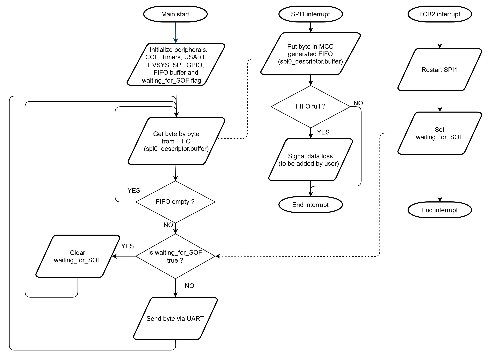
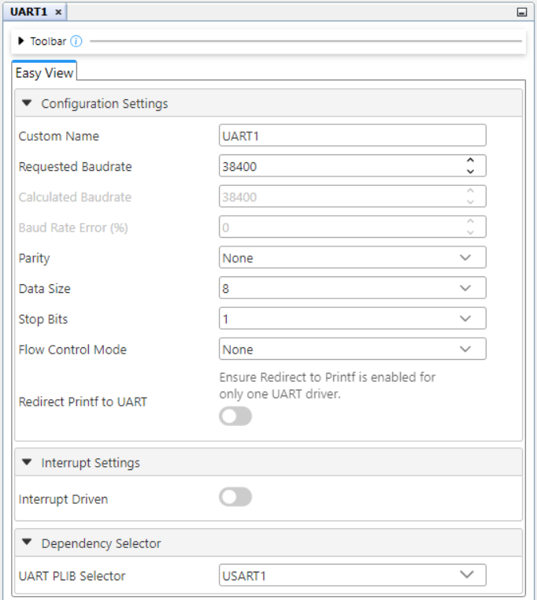
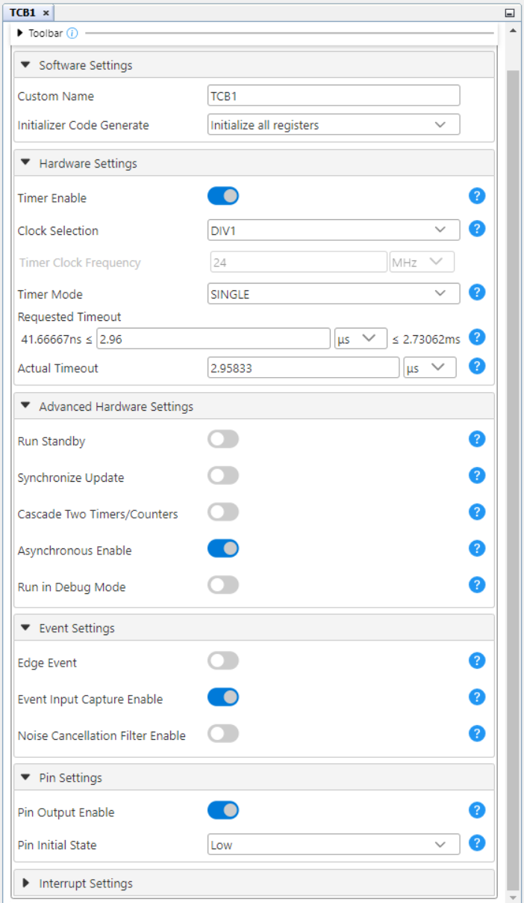

[](https://www.microchip.com)

## Manchester Decoder - Use Case for CIPs Using the AVR128DA48 Microcontroller with MCC Melody

The Manchester code is a line code in which the encoding of each data bit is either a transition from LOW to HIGH or a transition from HIGH to LOW. It is a self-clocking signal with no DC component.

There are two versions of the Manchester code. This project focuses on the Manchester coding as per IEEE 802.3. 
The Manchester code combines data and clock into a single signal, where one clock cycle is a Manchester-bit period. A transition always occurs in the middle of the bit period. Logic `0` is represented by a falling edge (HIGH to LOW transition) in the middle of the bit period, and logic `1` is represented by a rising edge (LOW to HIGH transition) in the middle of the bit period. 

In this application, the Manchester communication parameters are: baud rate 16000 bits/s, 8-bit transfer, MSb (Most Significant bit) is sent first, IEEE 802.3, Manchester version (negative edge is binary zero).

An example is presented in the figure below:

<br>

## Related Documentation

More details and code examples on the AVR128DA48 can be found at the following links:
- [AVR128DA48 Product Page](https://www.microchip.com/wwwproducts/en/AVR128DA48)
- [AVR128DA48 Code Examples on Discover](https://mplab-discover.microchip.com/v2?dsl=avr128da48)
- [AVR128DA48 Code Examples on GitHub](https://github.com/microchip-pic-avr-examples?q=avr128da48)

## Software Used
- [MPLAB X IDE v6.20 or newer](https://www.microchip.com/en-us/tools-resources/develop/mplab-x-ide)
- [MPLAB XC8 v2.46 or newer](https://www.microchip.com/en-us/tools-resources/develop/mplab-xc-compilers/xc8)
- [AVR-Dx_DFP v2.4.286 or newer](https://packs.download.microchip.com/)

## Hardware Used
- The [AVR128DA48 Curiosity Nano Development board (DM164151)](https://www.microchip.com/Developmenttools/ProductDetails/DM164151) is used as a test platform:
<br>
- Jumper wires

## Operation

To program the Curiosity Nano board with this MPLAB X project, follow the steps provided in the [How to Program the Curiosity Nano Board](#how-to-program-the-curiosity-nano-board) chapter.<br><br>

## Concept

This project is an implementation of a Manchester Decoder using Core Independent Peripherals (CIPs) by following the interaction between TCB, Event System, CCL and SPI peripherals. The encoded data are received through a single data wire. The NRZ (Non-Return-to-Zero) signal and clock signal are recovered using the circuit composed of the CIP mentioned above. The resulting signals are routed to the SPI peripheral which reads the data. The decoded data are transmitted further via serial communication.

The block diagram of this application is presented in the figure below: 

<br>

The Manchester encoded signal is received through a single wire. A decoding circuit is implemented using a combination of Configurable Custom Logic blocks and timers. The decoding circuit outputs the recovered NRZ data and a synchronized clock signal that are routed with jumper wires to the SPI1 peripheral configured in Client mode. The SPI1 peripheral will generate interrupts whenever a new byte is received, and the current byte will be stored in a buffer. The data are further transmitted via serial communication (USART1). A time-out mechanism is implement using TCB2 configured in periodic Time-out mode (an interrupt will be generated when no activity occurs on the Manchester data line for the duration of three bytes). A FIFO (First-In First-Out) buffer mechanism is implemented to facilitate the data storage and minimize data loss.

<br>


## Setup
The following peripheral and clock configurations are set up using the MPLAB Code Configurator (MCC) Melody for the AVR128DA48:

Global interrupts: Enabled

1. Clock Control:
  - Oscillator Frequency Selection: 24 MHz system clock
  
  <br>

1. USART1:
  - UART PLIB Selector: USART1
  - Enable USART Transmitter: Enabled
  - Requested Baudrate: 38400
  - Data Size: 8
  - Stop Bits: 1
  
  <br>
  <br>

1. SPI1:
  - SPI Client PLIB Selector: SPI1
  - SPI1 Type: Client
  - SPI1 Mode: Mode 0
  - Config Name: CLIENT_CONFIG
  - Interrupt Driven: Enabled
  
  <br>

1. EVSYS:
  - Event Generators:
    - CCL_LUT0:  CHANNEL0
    - CCL_LUT2:  CHANNEL1
    - CCL_LUT4: CHANNEL2
    - CCL_LUT3: CHANNEL5
  - Event Users:
    - CHANNEL0: CCLLUT2B
    - CHANNEL1: TCB0CAPT
    - CHANNEL2: CCLLUT0A, CCLLUT2A
    - CHANNEL5: TCB1CAPT, TCB2CAPT  
  
2. CCL:
  - Enable CCL: Enabled
  - LUT0:
    - Enable LUT: Enabled
    - Enable LUT output: Enabled
    - Filter Options: DISABLE
    - Clock Selection: CLKPER
    - Sequential Logic: DFF
    - IN0: EVENTA
    - IN1: MASK
    - IN2: MASK
    - Gate Type: Custom
    - OUT result: 0x2
  
   <br>
  
  - LUT1:
    - Enable LUT: Enabled
    - Enable LUT output: Enabled
    - Filter Options: DISABLE
    - Clock Selection: CLKPER
    - Sequential Logic: DFF
    - IN0: MASK
    - IN1: TCB1
    - IN2: MASK
    - Gate Type: Custom
    - OUT result: 0x4
  
   <br>

  - LUT2:
    - Enable LUT: Enabled
    - Enable LUT output: Enabled
    - Filter Options: DISABLE
    - Clock Selection: CLKPER
    - Sequential Logic: DISABLE
    - IN0: EVENTA
    - IN1: EVENTB
    - IN2: MASK
    - Gate Type: Custom
    - OUT result: 0x6
  
   <br>
  
  - LUT3:
    - Enable LUT: Enabled
    - Enable LUT output: Enabled
    - Filter Options: DISABLE
    - Clock Selection: CLKPER
    - Sequential Logic: DISABLE
    - IN0: TCB0
    - IN1: MASK
    - IN2: MASK
    - Gate Type: Custom
    - OUT result: 0x1
  
   <br>

  - LUT4:
    - Enable LUT: Enabled
    - Enable LUT output: Enabled
    - Filter Options: DISABLE
    - Clock Selection: CLKPER
    - Sequential Logic: DISABLE
    - IN0: MASK
    - IN1: MASK
    - IN2: IN2
    - Gate Type: Custom
    - OUT result: 0x1
  
   <br>
    
3. TCB0:
  - Enable Timer: Enabled
  - Clock Selection: DIV1
  - Timer Mode: Single
  - Requested Timeout (s): 0.00004696 (46.9583 μs)
  - Enable Asynchronous: Enabled
  - Enable Event Input Capture: Enabled
  - Enable Pin Output: Enabled
  
  <br> 

1. TCB1:
  - Enable Timer: Enabled
  - Clock Selection: DIV1
  - Timer Mode: Single
  - Requested Timeout (s): 0.00000296 (2.9583 μs)
  - Enable Asynchronous: Enabled
  - Enable Event Input Capture: Enabled
  - Enable Pin Output: Enabled
  
  <br>

1. TCB2:
  - Enable Timer: Enabled
  - Clock Selection: DIV1
  - Timer Mode: Time-out
  - Requested Timeout (s): 0.000374917 (374.9167 μs)
  - Enable Event Input Capture: Enabled
  - Enable Noise Cancellation Filter: Enabled
  - Generate ISR: Enabled
  - Enable Capture/Timeout Interrupt: Enabled
  
  <br>  


 |                        Pin                       |    Configuration   |
 | :----------------------------------------------: | :----------------: |
 |     PC4 (SPI1 - MOSI)                            |   Digital Input    |
 |     PC5 (SPI1 - MISO)                            |   Digital Output   |
 |     PC6 (SPI1 - SCK)                             |   Digital Input    |
 |     PC7 (SPI1 - SS)                              |   Digital Input    | 
 |     PC0 (USART1 - TX)                            |   Digital Output   |
 |     PC1 (USART1 - RX)                            |   Digital Input    |
 |     PA3 (TCB1_OUT)                               |   Digital Output   |
 |     PA2 (TCB0_OUT)                               |   Digital Output   |
 |     PA6 (LUT0_OUT)  - NRZ Data Signal            |   Digital Output   |
 |     PC3 (LUT1_OUT)                               |   Digital Output   |
 |     PD3 (LUT2_OUT)  - Recovered Clock Signal     |   Digital Output   |
 |     PF3 (LUT3_OUT)                               |   Digital Output   |
 |     PB2 (LUT4_INSEL2) - Encoded Data Signal      |   Digital Input    |
 |     PB3 (LUT4_OUT)                               |   Digital Output   |


 Additional connections needed (with jumper wires):

 |               Pin 1                 |        Pin 2       |
 | :---------------------------------: | :----------------: |
 |     PA6 - NRZ Data signal           |   PC4 - SPI1 MOSI  |
 |     PD3 - Recovered Clock signal    |   PC6 - SPI1 SCK   |
 |     PC7 - Client select for SPI1    |   GND              |


 **Important:** The encoder's board PD3 pin must be connected with the decoder's board PB2 pin (Manchester data bus).

## Demo

In the demo, the ```Microchip!``` message is received in the serial terminal connected to the decoder board. Also, the recovered NRZ and Clock signal can be visualized with a logic analyzer.

<br>

<br>

To use the embedded decoder from the Logic software, the next analyzers settings must be set: 
 - Manchester encoded signal on PD3:
  
  <br>

   - NRZ Data on PC4:
  
  <br>
   
   - Manchester decoded signal on PC0:
  
  <br>


## Summary

This demo shows how to implement a CIP solution for a Manchester decoder using a circuit composed of SPI, USART, CCL, Timers and Event System peripherals.
This CIP solution can be used at high baud rates, the decoding process being implemented in the CIP circuit, and the CPU is used only at storing the received data in a buffer.

## How to Program the Curiosity Nano Board
 1. Connect the board to the PC.

 2. Open the Manchester_Decoder.X project in MPLAB X.

 3. Set the Manchester_Decoder.X project as main project. Right click on the project in the **Projects** tab and click **Set as Main Project**.
 
 <br>

 4. Clean and build the Manchester_Decoder.X project: Right click on the **Manchester_Decoder.X** project and select **Clean and Build**.

 <br>

 5. Select the **AVR128DA48 Curiosity Nano** in the Connected Hardware Tool section of the project settings:
   - Right click on the project and click **Properties**
   - Click on the arrow right next to Connected Hardware Tool
   - Select the **AVR128DA48 Curiosity Nano** (click on the **SN**), click **Apply**, and then click **OK**:

   <br>

 6. Program the project to the board: Right click on the project and click **Make and Program Device**.

<br>

## Menu 
<!-- no toc -->
- [Back to Top](#manchester-decoder---use-case-for-cips-using-the-avr128da48-microcontroller-with-mcc-melody)
- [Back to Related Documentation](#related-documentation)
- [Back to Software Used](#software-used)
- [Back to Hardware Used](#hardware-used)
- [Back to Operation](#operation)
- [Back to Concept](#concept)
- [Back to Setup](#setup)
- [Back to Demo](#demo)
- [Back to Summary](#summary)
- [Back to How to Program the Curiosity Nano Board](#how-to-program-the-curiosity-nano-board)