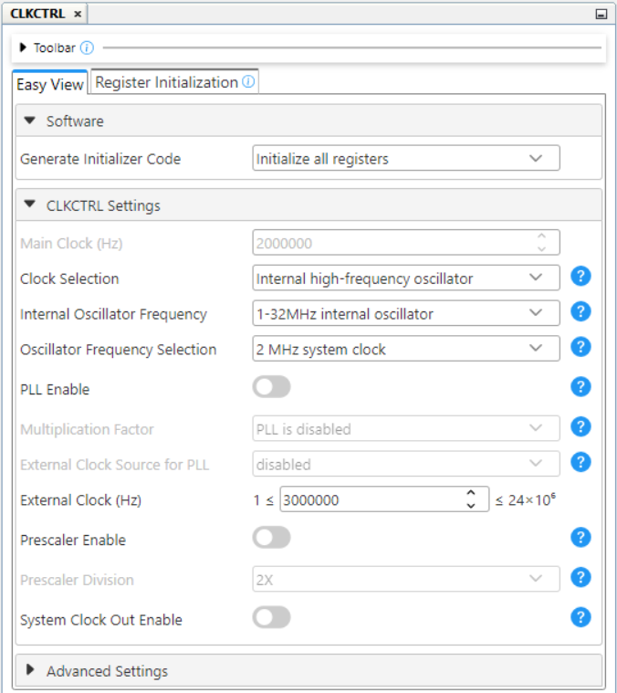
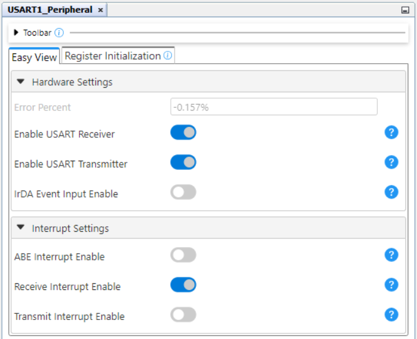
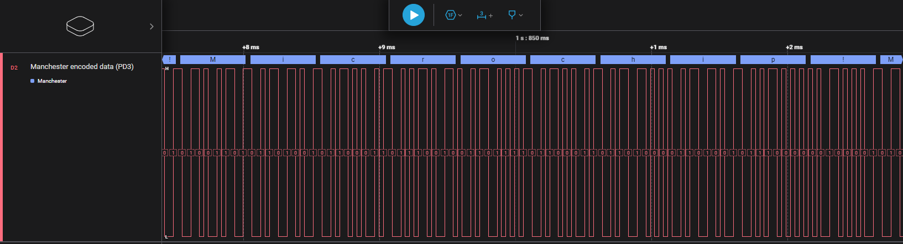

[](https://www.microchip.com)

## Manchester Encoder - Use Case for CIPs Using the AVR128DA48 Microcontroller with MCC Melody

The Manchester code is a line code in which the encoding of each data bit is either a transition from LOW to HIGH or a transition from HIGH to LOW. It is a self-clocking signal with no DC component.

This project focuses on the Manchester coding as per IEEE 802.3. The
Manchester code combines data and clock into a single signal, where one clock cycle is a Manchester-bit period with a transition always occurring in the middle of it. Logic '`0`' is represented by a falling edge (HIGH to LOW transition) in the middle of the bit period, and logic '`1`' is represented by a rising edge (LOW to HIGH transition) in the middle of the bit period. 

In this application the Manchester communication parameters are: 
- Baud rate: 16000 bits/s
- 8 bit transfer
- MSb (Most Significant bit) is sent first
- IEEE 802.3. 
- Manchester version (negative edge is binary zero)

An example is presented in the figure below:

<br>

## Related Documentation

More details and code examples on the AVR128DA48 can be found at the following links:
- [AVR128DA48 Product Page](https://www.microchip.com/wwwproducts/en/AVR128DA48)
- [AVR128DA48 Code Examples on Discover](https://mplab-discover.microchip.com/v2?dsl=avr128da48)
- [AVR128DA48 Code Examples on GitHub](https://github.com/microchip-pic-avr-examples?q=avr128da48)

## Software Used
- [MPLAB X IDE v6.20 or newer](https://www.microchip.com/en-us/tools-resources/develop/mplab-x-ide)
- [MPLAB XC8 v2.46 or newer](https://www.microchip.com/en-us/tools-resources/develop/mplab-xc-compilers/xc8)
- [AVR®-Dx_DFP v2.4.286 or newer](https://packs.download.microchip.com/)

## Hardware Used
- The [AVR128DA48 Curiosity Nano Development board (DM164151)](https://www.microchip.com/Developmenttools/ProductDetails/DM164151) is used as a test platform:
<br>

## Operation

To program the Curiosity Nano board with this MPLAB X project, follow the steps provided in the [How to Program the Curiosity Nano Board](#how-to-program-the-curiosity-nano-board) chapter.<br><br>

## Concept

This project is an implementation of a Manchester Encoder using CIP (Core Independent Peripherals) by following the interaction between the Universal Synchronous Asynchronous Receiver Transmitter (USART), Serial Peripheral Interface (SPI), Event System (EVSYS) and Configurable Custom Logic (CCL) peripherals. The raw data are received via serial communication, encoded using a circuit composed of the CIP mentioned above and sent further through a single data wire.

The block diagram of this application is presented in the figure below: 

<br>

The raw data are received via serial communication by the USART1 peripheral. These data are then stored in a buffer and used as input for the SPI0 peripheral (configured in Host mode 1) which generates  Non-Return-to-Zero (NRZ) data signal and a clock signal. Those signals are selected as inputs for the CCL peripheral which outputs the exclusive or logic operation between the two selected inputs. The result of the XOR operation between the raw data signal and clock represents the Manchester encoded data. The First-In First-Out (FIFO) buffer mechanism is used to facilitate the data storage and minimize data loss.

<br>

## Setup
The following peripheral and clock configurations are set up using the MPLAB Code Configurator (MCC) Melody for the AVR128DA48:

1. Clock Control:
  - Oscillator Frequency Selection: 2 MHz system clock
  
  <br>

2. USART1:
  - UART PLIB Selector: USART1
  - Enable USART Receiver: Enabled
  - Enable USART Transmitter: Enabled
  - Receive Interrupt Enable: Enabled
  - Requested Baud Rate: 19200
  - Data Size: 8
  - Stop Bits: 1
  - Interrupt Driven: Enabled
  - Software Receive Buffer Size: 128
  
  <br>
  <br>

3. SPI0:
  - SPI Host PLIB Selector: SPI0
  - SPI0 Type: Host
  - SPI0 Mode: Mode 1
  - Config Name: HOST_CONFIG
  - Requested Speed: 10 kHz
  
  <br>

4. EVSYS:
  - Event Generators:
    - USART0_XCK: CHANNEL1
  - Event Users:
    - CHANNEL1: CCLLUT2A

5. CCL:
  - Enable CCL: Enabled
  - LUT2:
    - Enable LUT: Enabled
    - Enable LUT output: Enabled
    - Filter Options: SYNCH
    - Clock Selection: CLKPER
    - Sequential Logic: DISABLE
    - IN0: SPI0
    - IN1: EVENTA
    - IN2: MASK
    - Gate Type: Custom
    - OUT result: 0x6
  
   <br>

6. Interrupt Manager:
  - Global Interrupt Enable: Enabled
  - SPI1 RXC: Enabled
  - SPI1 IE: Enabled

 |                         Pin                          |    Configuration   |
 | :--------------------------------------------------: | :----------------: |
 |     PC0 (USART1 - TX)                                |   Digital output   |
 |     PC1 (USART1 - RX)                                |   Digital input    |
 |     PA5 (SPI0 - MISO)                                |   Digital input    |
 |     PA4 (SPI0 - MOSI)                                |   Digital output   |
 |     PA6 (SPI0 - SCK)                                 |   Digital output   |
 |     PD3 (LUT2_OUT) - Manchester Encoded Signal       |   Digital output   |

 **Important:** The PD3 pin of the encoder board must be connected with the PB2 pin of the decoder board PB2 pin (Manchester data bus).

## Demo
In the demo, the ```Microchip!``` message was inserted by the user in the terminal. Pin PD3 (the output pin for the Manchester encoded signal) was visualized using a logic analyzer.

<br>

<br>

To use the embedded decoder from the Logic software, the next analyzer settings must be set: 
 - Manchester encoded signal on PD3:
  
  <br>

## Summary

This demo shows how to implement a CIP solution for a Manchester encoder using USART, CCL and Event System peripherals. This CIP solution can be used at high baud rates, the encoding process being implemented with minimum effort from the CPU.

##  How to Program the Curiosity Nano Board

This chapter demonstrates how to use the MPLAB X IDE to program an AVR® device with an ```Example_Project.X```. This is applicable to other projects.

1.  Connect the board to the PC.

2.  Open the ```Example_Project.X``` project in MPLAB X IDE.

3.  Set the ```Example_Project.X``` project as main project.
    <br>Right click the project in the **Projects** tab and click Set as Main Project.
    <br>

4.  Clean and build the ```Example_Project.X``` project.
    <br>Right click the ```Example_Project.X``` project and select Clean and Build.
    <br>

5.  Select AVRxxxxx Curiosity Nano in the Connected Hardware Tool section of the project settings:
    <br>Right click the project and click **Properties**.
    <br>Click the arrow under the Connected Hardware Tool.
    <br>Select AVRxxxxx Curiosity Nano (click the **SN**), click **Apply** and then click **OK**:
    <br>

6.  Program the project to the board.
    <br>Right click the project and click **Make and Program Device**.
    <br>

<br>

## Menu 
<!-- no toc -->
- [Back to Top](#manchester-encoder---use-case-for-cips-using-the-avr128da48-microcontroller-with-mcc-melody)
- [Back to Related Documentation](#related-documentation)
- [Back to Software Used](#software-used)
- [Back to Hardware Used](#hardware-used)
- [Back to Operation](#operation)
- [Back to Concept](#concept)
- [Back to Setup](#setup)
- [Back to Demo](#demo)
- [Back to Summary](#summary)
- [Back to How to Program the Curiosity Nano Board](#how-to-program-the-curiosity-nano-board)