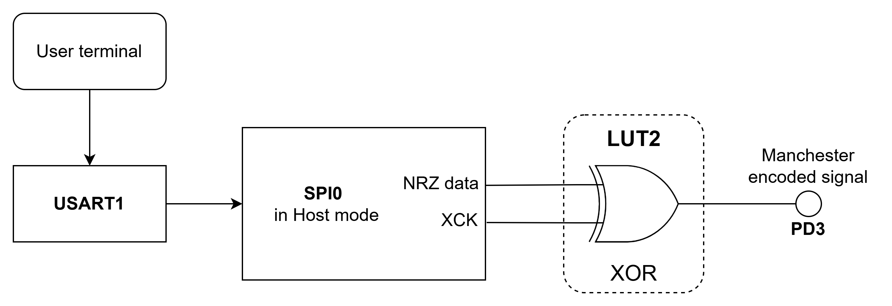

 # Manchester Encoder

The Manchester code is a line code in which the encoding of each data bit is either a transition from LOW to HIGH or a transition from HIGH to LOW. It is a self-clocking signal with no DC component.

There are two versions of the Manchester code. This project focuses on the Manchester coding as per IEEE 802.3. The
Manchester code combines data and clock into a single signal, where one clock cycle is a Manchester-bit period. A transition always occurs in the middle of the bit period. Logic `0` is represented by a falling edge (HIGH to LOW transition) in the middle of the bit period, and logic `1` is represented by a rising edge (LOW to HIGH transition) in the middle of the bit period. 

In this application the Manchester communication parameters are: baud rate 16000 bits/s, 8 bit transfer, MSb (Most Signifacnt bit) is sent first, IEEE 802.3. Manchester version (negative edge is binary zero).

An example is presented in the figure below:

 

This project is an implementation of a Manchester Encoder using CIP (Core Independent Peripherals) by following the interaction between USART, Event System and CCL peripherals. The raw data are received via serial communication, encoded using a circuit composed of the CIP mentioned above and sent further through a single data wire.

The raw data are received via serial communication by the USART1 peripheral. These data are then stored in a buffer and used as input for the USART0 peripheral (configured in SPI mode) which generates NRZ (Non-return-to-zero) data signal and a clock signal. Those signals are selected as inputs for the CCL (Configurable Custom Logic) peripheral which outputs the exclusive or logic operation between the two selected inputs. The XOR operation between the raw data signal and clock represent the Manchester encoded data. A FIFO (First-In First-Out) buffer mechanism is implemented to facilitate the data storage and minimize data loss.

The block diagram of this application is presented in the figure below: 

 

## Related Documentation
More details and code examples on the AVR128DA48 can be found at the following links:
- [AVR128DA48 Product Page](https://www.microchip.com/wwwproducts/en/AVR128DA48)
- [AVR128DA48 Code Examples on GitHub](https://github.com/microchip-pic-avr-examples?q=avr128da48)
- [AVR128DA48 Project Examples in START](https://start.atmel.com/#examples/AVR128DA48CuriosityNano)

## Software Used
- MPLAB® X IDE 5.40 or newer [(microchip.com/mplab/mplab-x-ide)](http://www.microchip.com/mplab/mplab-x-ide)
- MPLAB® XC8 2.30 or a newer compiler [(microchip.com/mplab/compilers)](http://www.microchip.com/mplab/compilers)
- MPLAB® Code Configurator (MCC) 4.0.1 or newer [(microchip.com/mplab/mplab-code-configurator)](https://www.microchip.com/mplab/mplab-code-configurator)
- MPLAB® Code Configurator (MCC) Device Libraries 8-bit AVR MCUs 2.5.0 or newer [(microchip.com/mplab/mplab-code-configurator)](https://www.microchip.com/mplab/mplab-code-configurator)
- AVR-Dx_DFP 1.6.88 or newer Device Pack

## Hardware Used
- AVR128DA48 Curiosity Nano [(DM164151)](https://www.microchip.com/Developmenttools/ProductDetails/DM164151)
- Jumper wires

## Setup

The AVR128DA48 Curiosity Nano Development Board is used as test platform.

 

The following configurations must be made for this project:

System clock: 24 MHz

Global interrupts: Enabled

USART0:
  - 16000 baud rate
  - TX enabled
  - Master SPI mode enabled
  - 8N1 (character size: 8 bit, no parity, 1 Stop bit)

USART1:
  - 19200 baud rate
  - RX enabled
  - RXC interrupt enabled
  - Async mode
  - 8N1 (character size: 8 bit, no parity, 1 Stop bit)

EVSYS:
  - Event Generators:
    - USART0_XCK: CHANNEL1
  - Event Users:
    - CHANNEL1: CCLLUT2A

LUT2:
  - IN0: USART0
  - IN1: EVENT A
  - IN2: Masked
  - TRUTH table: 0x06
  - Clock source: CLKPER
  - Output Enabled

 |Pin                       | Configuration      |
 | :---------------------:  | :----------------: |
 |     PA0 (USART0 - TX)    |   Digital Output   |
 |     PA1 (USART0 - RX)    |    Digital Input   |
 |     PC0 (USART1 - TX)    |   Digital Output   |
 |     PC1 (USART1 - RX)    |    Digital Input   |
 |     PD3 (LUT2_OUT) - Manchester Encoded Signal       |   Digital Output   |

 **Important:** The encoder's board PD3 pin must be connected with the decoder's board PB2 pin (Manchester data bus).

 ## Software
 Encoder Software Flowchart
 

 ## Operation
 1. Connect the board to the PC.

 2. Open the Manchester_Encoder.X project in MPLAB X.

 3. Set the Manchester_Encoder.X project as main project. Right click on the project in the **Projects** tab and click **Set as Main Project**.
 
  

 4. Clean and build the Manchester_Encoder.X project: right click on the **Manchester_Encoder.X** project and select **Clean and Build**.

  

 5. Select the **AVR128DA48 Curiosity Nano** in the Connected Hardware Tool section of the project settings:
   - Right click on the project and click **Properties**
   - Click on the arrow right next to Connected Hardware Tool
   - Select the AVR128DA48 Curiosity Nano (click on the **SN**), click **Apply** and then click **OK**:

    

 6. Program the project to the board: Right click on the project and click **Make and Program Device**.

 

 Demo:

In the demo, the "Microchip test !" message was inserted by the user in the terminal. Pin PD3 (the output pin for the Manchester encoded signal) was visualized using a logic analyzer.

 
 

 ## Summary

This demo shows how to implement a CIP solution for a Manchester encoder using USART, CCL and Event System peripherals. This CIP solution can be used at high baud rates, the encoding process being implemented with minimum effort from the CPU.
