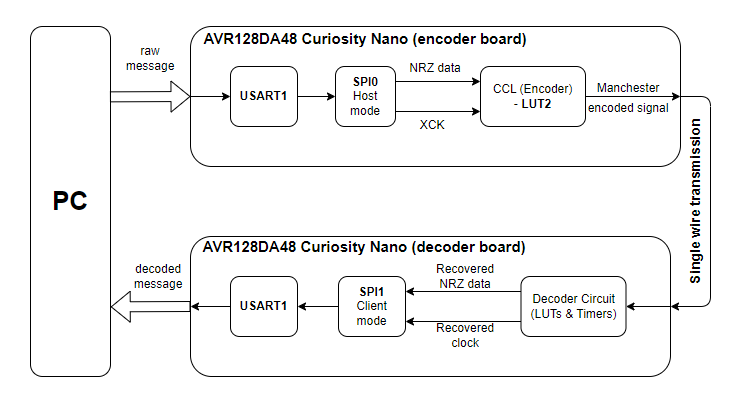

<!-- Please do not change this logo with link -->
[](https://www.microchip.com)

# Manchester Encoder and Decoder - Use Case for CIPs Using the AVR128DA48 Microcontroller with MCC Melody

  <br>The repository contains two MPLAB® X projects:

  * [<strong>Manchester Encoder:</strong>](Manchester_Encoder) This project is an implementation of a Manchester Encoder using Core Independent Peripherals (CIPs) by following the interaction between the Universal Synchronous Asynchronous Receiver Transmitter (USART), Serial Peripheral Interface (SPI), Event System (EVSYS) and Configurable Custom Logic (CCL) peripherals
  * [<strong>Manchester Decoder:</strong>](Manchester_Decoder) This project is an implementation of a Manchester Decoder using CIPs by following the interaction between Timer/Counter Type B (TCB), Event System, CCL and SPI peripherals

  The setup is presented in the diagram below:

<br>

## Related Documentation
More details and code examples on the AVR128DA48 can be found at the following links:
- [AVR128DA48 Product Page](https://www.microchip.com/wwwproducts/en/AVR128DA48)
- [AVR128DA48 Code Examples on GitHub](https://github.com/microchip-pic-avr-examples?q=avr128da48)
- [AVR128DA48 Project Examples in START](https://start.atmel.com/#examples/AVR128DA48CuriosityNano)

## Software Used
- [MPLAB X IDE v6.20 or newer](https://www.microchip.com/en-us/tools-resources/develop/mplab-x-ide)
- [MPLAB XC8 v2.46 or newer](https://www.microchip.com/en-us/tools-resources/develop/mplab-xc-compilers/xc8)
- [AVR-Dx_DFP v2.4.286 or newer](https://packs.download.microchip.com/)

## Hardware Used

- Two [AVR128DA48 Curiosity Nano Development board (DM164151)](https://www.microchip.com/Developmenttools/ProductDetails/DM164151) are used as test platforms:
<br>
- 4x Jumper wires

## Operation

To program the Curiosity Nano board with this MPLAB X project, follow the steps provided in the [How to Program the Curiosity Nano Board](#how-to-program-the-curiosity-nano-board) chapter.<br><br>

## Demo

In the demo, the ```Microchip!``` message was inserted by the user in the terminal. Pin PD3 of the encoder platform (the output pin for the Manchester encoded signal) is connected to pin PB2 of the decoder board and visualized using the MPLAB Data Visualizer plug-in.

<br>


##  How to Program the Curiosity Nano Board

This chapter demonstrates how to use the MPLAB X IDE to program an AVR® device with an ```Example_Project.X```. This is applicable to other projects.

1.  Connect the board to the PC.

2.  Open the ```Example_Project.X``` project in MPLAB X IDE.

3.  Set the ```Example_Project.X``` project as main project.
    <br>Right click the project in the **Projects** tab and click Set as Main Project.
    <br>

4.  Clean and build the ```Example_Project.X``` project.
    <br>Right click the ```Example_Project.X``` project and select Clean and Build.
    <br>

5.  Select AVRxxxxx Curiosity Nano in the Connected Hardware Tool section of the project settings:
    <br>Right click the project and click **Properties**.
    <br>Click the arrow under the Connected Hardware Tool.
    <br>Select AVRxxxxx Curiosity Nano (click the **SN**), click **Apply** and then click **OK**:
    <br>

6.  Program the project to the board.
    <br>Right click the project and click **Make and Program Device**.
    <br>

<br>

## Menu 
<!-- no toc -->
- [Back to Top](#manchester-encoder-and-decoder---use-case-for-cips-using-the-avr128da48-microcontroller-with-mcc-melody)
- [Back to Related Documentation](#related-documentation)
- [Back to Software Used](#software-used)
- [Back to Hardware Used](#hardware-used)
- [Back to Operation](#operation)
- [Back to Demo](#demo)
- [Back to How to Program the Curiosity Nano Board](#how-to-program-the-curiosity-nano-board)